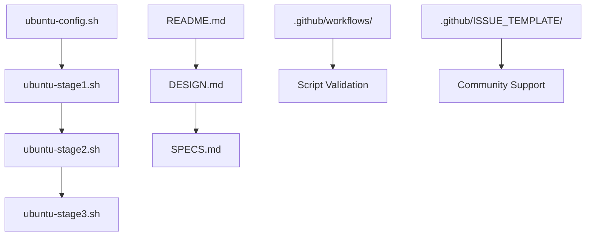

# Project Structure

This document outlines the structure and organization of the ZFS Root Installation Scripts project (version 0.1).

## 📁 Repository Structure

```
zfs-root-install/
├── 📄 README.md                    # Main project documentation
├── 📄 LICENSE                      # MIT License
├── 📄 CHANGELOG.md                 # Version history and changes
├── 📄 CONTRIBUTING.md              # Contribution guidelines
├── 📄 SECURITY.md                  # Security policy
├── 📄 PROJECT_STRUCTURE.md         # This file
├── 📄 .gitignore                   # Git ignore rules
│
├── 🔧 Ubuntu Installation Scripts
│   ├── ubuntu-stage1.sh            # Stage 1: Disk preparation and base system
│   ├── ubuntu-stage2.sh            # Stage 2: System configuration (chroot)
│   ├── ubuntu-stage3.sh            # Stage 3: Cleanup and finalization
│   └── ubuntu-config.sh            # Configuration file template
│
├── ❄️ NixOS Installation Scripts
│   ├── nixos-stage1.sh             # Stage 1: Disk preparation and config generation
│   ├── nixos-stage2.sh             # Stage 2: NixOS installation
│   ├── nixos-stage3.sh             # Stage 3: Cleanup and finalization
│   └── nixos-config.sh             # Configuration file template
│
├── 📚 Documentation
│   ├── DESIGN.md                   # Architecture and design documentation
│   ├── SPECS.md                    # Technical specifications
│   └── blog-post.md                # Development journey blog post
│
├── 🤖 GitHub Configuration
│   ├── .github/
│   │   ├── workflows/
│   │   │   └── validate.yml        # CI/CD validation workflow
│   │   ├── ISSUE_TEMPLATE/
│   │   │   ├── bug_report.md       # Bug report template
│   │   │   ├── feature_request.md  # Feature request template
│   │   │   └── support_question.md # Support question template
│   │   └── pull_request_template.md # Pull request template
│
└── 📋 Additional Files
    └── (Generated during installation)
```

## 🔧 Core Installation Scripts

## 🟠 Ubuntu Scripts

### ubuntu-stage1.sh
**Purpose**: Disk preparation and base system installation
- Disk partitioning (auto/manual modes)
- ZFS pool creation and management
- Base system installation with debootstrap
- Chroot environment setup
- Stage 2 execution coordination

**Key Functions**:
- `validate_required_config()` - Configuration validation
- `partition_disk()` - Disk partitioning
- `create_zfs_pools()` - ZFS pool creation
- `bind_mount()` - Flexible bind mounting
- `chroot_setup()` - Chroot environment preparation

### ubuntu-stage2.sh
**Purpose**: System configuration within chroot
- Locale and timezone configuration
- Kernel and ZFS installation
- GRUB bootloader setup
- User account creation
- SSH configuration
- Package installation

**Key Functions**:
- `install_kernel()` - Kernel and ZFS module installation
- `install_grub()` - GRUB bootloader configuration
- `create_users()` - User account management
- `install_openssh()` - SSH server setup

### ubuntu-stage3.sh
**Purpose**: Cleanup and system finalization
- Filesystem unmounting
- ZFS pool export
- Process cleanup
- Installation verification

**Key Functions**:
- `cleanup_mounts()` - Filesystem unmounting
- `aggressive_cleanup()` - Process termination
- `verify_installation()` - Final verification

### ubuntu-config.sh
**Purpose**: Centralized configuration management
- System settings (hostname, timezone, locale)
- Disk and partition configuration
- ZFS pool and dataset settings
- User account definitions
- Package selection
- Installation options

## ❄️ NixOS Scripts

### nixos-stage1.sh
**Purpose**: Disk preparation and NixOS configuration generation
- Disk partitioning (auto/manual modes)
- ZFS pool creation and management
- NixOS configuration.nix generation
- Hardware configuration generation
- Stage 2 execution coordination

**Key Functions**:
- `validate_config()` - Configuration validation
- `partition_disk()` - Disk partitioning
- `create_zfs_pool()` - ZFS pool creation
- `generate_nixos_config()` - NixOS configuration generation

### nixos-stage2.sh
**Purpose**: NixOS installation and system configuration
- NixOS channel setup
- System installation with nixos-install
- ZFS configuration and services
- Final system configuration

**Key Functions**:
- `setup_channels()` - NixOS channel configuration
- `install_nixos()` - System installation
- `configure_zfs()` - ZFS service setup
- `final_configuration()` - System finalization

### nixos-stage3.sh
**Purpose**: Cleanup and system finalization
- Filesystem unmounting
- ZFS pool export
- Process cleanup
- Installation verification

**Key Functions**:
- `unmount_filesystems()` - Filesystem unmounting
- `export_zfs_pools()` - ZFS pool export
- `aggressive_cleanup()` - Process termination
- `verify_cleanup()` - Final verification

### nixos-config.sh
**Purpose**: Centralized NixOS configuration management
- System settings (hostname, timezone, locale)
- Disk and partition configuration
- ZFS pool and dataset settings
- User account definitions
- NixOS packages and services
- Desktop environment selection

## 📚 Documentation Files

### README.md
- Project overview and features
- Quick start guide
- Installation instructions
- Usage examples
- Configuration reference

### DESIGN.md
- System architecture
- Component interactions
- Design decisions
- Implementation details

### SPECS.md
- Technical specifications
- Function requirements
- Configuration parameters
- Validation rules

### blog-post.md
- Development methodology
- AI-human collaboration story
- Technical evolution
- Lessons learned

## 🤖 GitHub Integration

### Workflows (.github/workflows/)
- **validate.yml**: Automated script validation
  - ShellCheck linting
  - Syntax validation
  - Documentation checks
  - Configuration validation

### Issue Templates (.github/ISSUE_TEMPLATE/)
- **bug_report.md**: Structured bug reporting
- **feature_request.md**: Feature enhancement requests
- **support_question.md**: User support and questions

### Pull Request Template
- **pull_request_template.md**: Standardized PR format
  - Change description
  - Testing checklist
  - Documentation updates
  - Code quality verification

## 🔄 Development Workflow

### 1. Configuration Phase
```
ubuntu-config.sh → Validation → User Review
```

### 2. Installation Phase
```
Stage 1 → Stage 2 → Stage 3 → Verification
```

### 3. Error Handling
```
Error Detection → User Notification → Recovery Options
```

### 4. Debug Framework
```
Debug Breaks → System Inspection → Controlled Termination
```

## 📊 File Relationships



## 🎯 Key Design Principles

1. **Modularity**: Clear separation of concerns across stages
2. **Configuration-Driven**: Centralized configuration management
3. **Error Resilience**: Comprehensive error handling and recovery
4. **User-Friendly**: Clear documentation and helpful error messages
5. **Production-Ready**: Enterprise-grade reliability and validation
6. **Collaborative**: Built through AI-human partnership

## 🚀 Getting Started

1. **Clone the repository**
2. **Review the documentation** (README.md, DESIGN.md)
3. **Configure your installation** (ubuntu-config.sh)
4. **Test in a virtual machine**
5. **Run the installation** (ubuntu-stage1.sh)

For detailed instructions, see the main [README.md](README.md) file.